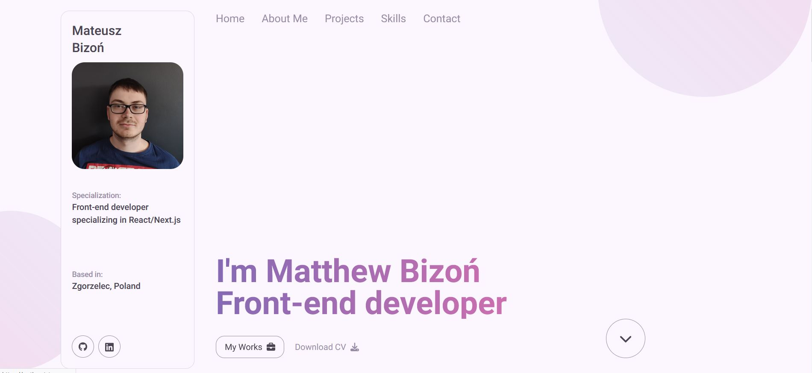

# Portfolio

## A web site build in Next.js that introduce myself and shows a little bit my experience as Front-end developer

This project is a quick introducing my life in private, in school and in software. In there I show also all my projects that I build so far not just in pure HTML and CSS but also in React, Next.js or in TailwindCSS. I mentioned about my front-end roadmap and where you can find me.

### [Live Site](https://portfoliomateuszbizon.netlify.app/)



### Built with

- Html5 semantic
- TailwindCSS
- Next.js
- Framer Motion

### Installation

1. Clone the repository

```bash
git clone https://github.com/mateuszbizon/portfolio.git
```

2. Install the dependencies

```bash
npm install
```

3. Start the server:

```bash
nmp run dev
```

4. Open application in the link: [http://localhost:3000](http://localhost:3000)